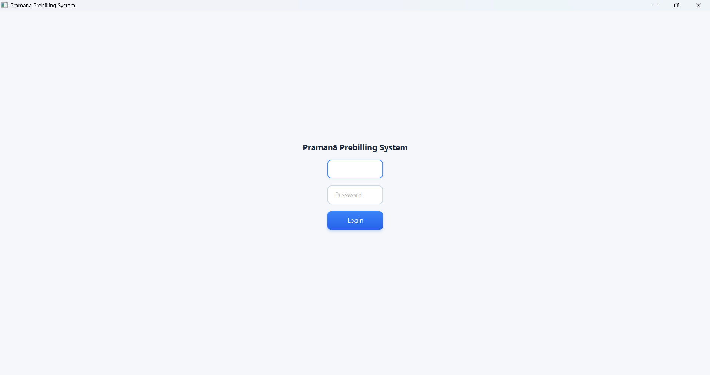
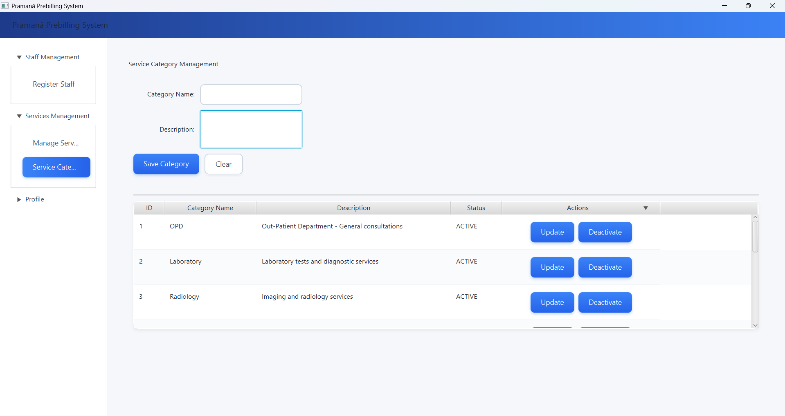
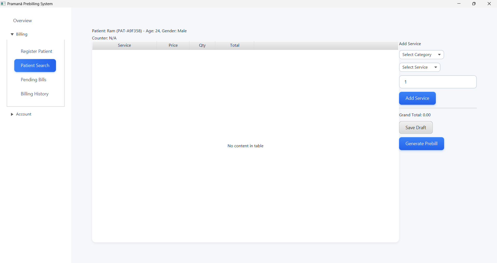
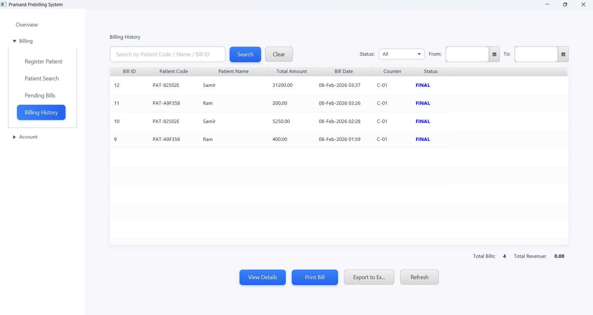
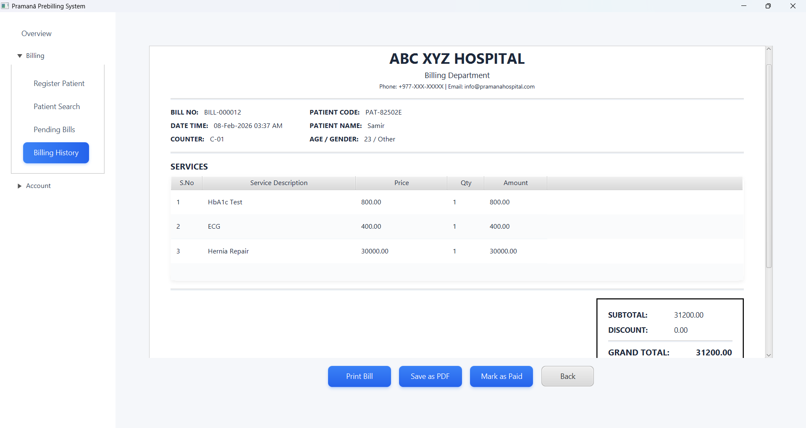

# Pramana: Prebilling System for Hospital

A comprehensive JavaFX-based hospital billing management system designed to streamline patient billing operations, manage service records, and generate professional invoices.


## 📋 Table of Contents
- [Overview](#overview)
- [Technology Stack](#technology-stack)
- [Core Features](#core-features)
- [Database Schema](#database-schema)
- [Installation](#installation)
- [Usage](#usage)
- [Screenshots](#screenshots)

## 🎯 Overview

The Pramana is a desktop application built to manage the complete billing workflow in a healthcare facility. It provides role-based access control, comprehensive patient management, service tracking, and professional bill generation with print capabilities.

## 🛠️ Technology Stack

### Languages
- **Java** - Core application logic
- **FXML** - UI layout and design
- **SQL** - Database queries and management

### Frameworks & Libraries
- **JavaFX** - User interface framework
- **MySQL** - Database management system
- **JDBC** - Database connectivity

### Architecture
- **MVC (Model-View-Controller)** - Application architecture pattern
- **Session Management** - User authentication and state management

## ✨ Core Features

### 🔐 Authentication & Authorization
- Secure login system with role-based access control
- Two user roles: **Admin** and **Staff**
- Session management

### 👥 Patient Management
- Advanced patient search with multiple filters
- Patient registration and profile management
- Quick search by ID, name, phone, or address
- Patient history tracking

### 💰 Billing Operations

#### Create New Bills
- Quick patient search and selection
- Service category browsing
- Multiple service selection with quantity management
- Real-time bill amount calculation
- Draft bill creation and management

#### Pending Bills Management
- View all pending/draft bills
- Edit and update pending bills
- Add or remove services from existing bills
- Finalize bills with payment processing

#### Billing History
- Comprehensive bill search and filtering
- Date range filtering
- Status-based filtering (Paid/Pending)
- Bill details view and reprint

### 🖨️ Bill Generation
- Professional bill format with hospital branding
- Detailed service itemization
- Tax and discount calculations
- Counter and cashier information
- Print-ready invoice layout

### 📊 Service Management (Admin Only)
- Service category management
- Service creation and pricing
- Service activation/deactivation
- Bulk service updates

### 👨‍💼 User Management (Admin Only)
- Staff account creation and management
- Role assignment
- Counter allocation
- User activation/deactivation

## 🗄️ Database Schema

The system uses a MySQL database with the following core tables:

- **users** - Staff and admin accounts with counter assignments
- **patients** - Patient demographic and contact information
- **bills** - Bill header with patient, amount, and status
- **bill_items** - Individual services included in each bill
- **services** - Available hospital services with pricing
- **service_categories** - Service categorization

### Key Relationships
```
users (1) -----> (N) bills
patients (1) -----> (N) bills
bills (1) -----> (N) bill_items
services (1) -----> (N) bill_items
service_categories (1) -----> (N) services
```

## 🚀 Installation

### Prerequisites
- **Java JDK 11** or higher
- **JavaFX SDK** (if not included in JDK)
- **MySQL Server 8.0** or higher
- **IDE** (IntelliJ IDEA)

### Setup Steps

1. **Clone the repository**
```bash
git clone https://github.com/ryomensuzan/pramana.git
cd pramana
```

2**Configure Database Connection**

Update `app/db/DBConnection.java` with your MySQL credentials:
```java
private static final String URL = "jdbc:mysql://localhost:3306/pramana";
private static final String USER = "your_username";
private static final String PASSWORD = "your_password";
```

4. **Build and Run**
```bash

# Run from your IDE
# Main class: app.Main
```

## 📖 Usage

### Default Login Credentials

**Admin Account:**
- Username: `admin`
- Password: `admin`

**Staff Account:**
- Username: `staff`
- Password: `staff123`

> ⚠️ **Important:** Change default passwords after first login

### Workflow

1. **Login** - Authenticate with username and password
2. **Dashboard** - Access role-specific dashboard
3. **Patient Search** - Find or register patient
4. **Create Bill** - Select services and create draft bill
5. **Review Pending Bills** - Edit or finalize pending bills
6. **Payment Processing** - Finalize bill with payment
7. **Print Invoice** - Generate and print professional bill

## 📸 Screenshots

### Login Page


*Secure authentication with role-based access*

---

### Admin Dashboard


*Comprehensive administrative controls and system management*

---

### Staff Dashboard


*Streamlined billing operations interface*

---

### Create Bill Interface


*Service selection and bill creation workflow*

---

### Billing History


*Search and filter historical bills*

---

### Bill Format


*Professional invoice layout with detailed itemization*


---

## 🔑 Key Components

### Session Management
The `SessionManager` class handles user authentication state and counter assignments throughout the application lifecycle.

### Database Connection
Centralized database connection management through `DBConnection` class with proper connection pooling and error handling.

### MVC Architecture
- **Models**: Data structures representing database entities
- **Views**: FXML layouts defining UI components
- **Controllers**: Business logic and UI event handling

### DashboardAware Interface
Navigation pattern for switching between views within dashboard content area without replacing entire scenes.

## 💡 Development Guidelines

### Code Standards
- Follow Java naming conventions
- Use meaningful variable and method names
- Add comprehensive comments for complex logic
- Implement proper error handling and logging

### Database Operations
- Use PreparedStatement to prevent SQL injection
- Always close database resources properly
- Implement transaction management for critical operations

## 🔮 Future Enhancements

- [ ] Insurance claim management
- [ ] Appointment scheduling integration
- [ ] Advanced reporting and analytics
- [ ] Multi-language support
- [ ] Backup and restore functionality
- [ ] API for third-party integrations

## 🐛 Troubleshooting

### Common Issues

**Database Connection Failed**
- Verify MySQL server is running
- Check database credentials in `DBConnection.java`
- Ensure database exists and schema is imported

**Bills Not Displaying**
- Check session management and counter assignment
- Verify foreign key relationships in database
- Review application logs for errors

**Print Function Not Working**
- Ensure printer drivers are installed
- Check JavaFX print permissions
- Verify print layout in `preBill.fxml`

## 📧 Contact

**Developer:** Sujan Katwal  
**Website:** www.sujankatuwal.com.np  
**GitHub:** [@ryomensuzan](https://github.com/ryomensuzan)

---

**Note:** This is an educational project.

---

Made with ❤️ by ryomensuzan